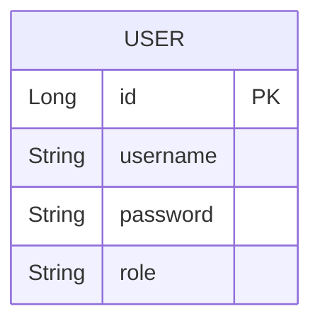
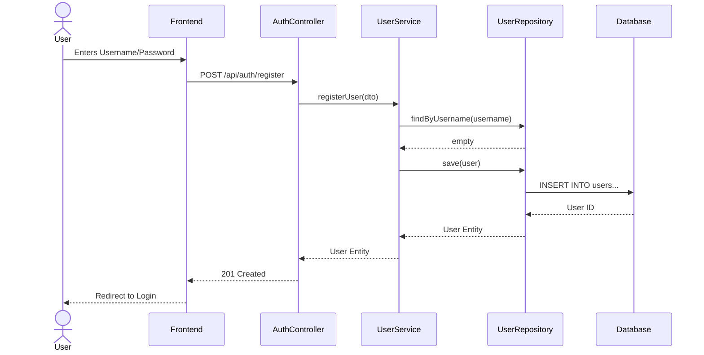
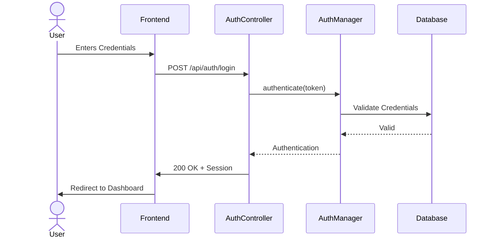

# System Diagrams

## Entity Relationship Diagram (ERD)

```mermaid
erDiagram
    USER {
        Long id PK
        String username
        String password
        String role
    }
```

## UML Sequence Diagram: Registration

```mermaid
sequenceDiagram
    actor User
    participant Frontend
    participant AuthController
    participant UserService
    participant UserRepository
    participant Database

    User->>Frontend: Enters Username/Password
    Frontend->>AuthController: POST /api/auth/register
    AuthController->>UserService: registerUser(dto)
    UserService->>UserRepository: findByUsername(username)
    UserRepository-->>UserService: empty
    UserService->>UserRepository: save(user)
    UserRepository->>Database: INSERT INTO users...
    Database-->>UserRepository: User ID
    UserRepository-->>UserService: User Entity
    UserService-->>AuthController: User Entity
    AuthController-->>Frontend: 201 Created
    Frontend-->>User: Redirect to Login
```

## UML Sequence Diagram: Login

```mermaid
sequenceDiagram
    actor User
    participant Frontend
    participant AuthController
    participant AuthManager
    participant Database

    User->>Frontend: Enters Credentials
    Frontend->>AuthController: POST /api/auth/login
    AuthController->>AuthManager: authenticate(token)
    AuthManager->>Database: Validate Credentials
    Database-->>AuthManager: Valid
    AuthManager-->>AuthController: Authentication
    AuthController->>Frontend: 200 OK + Session
    Frontend->>User: Redirect to Dashboard
```
